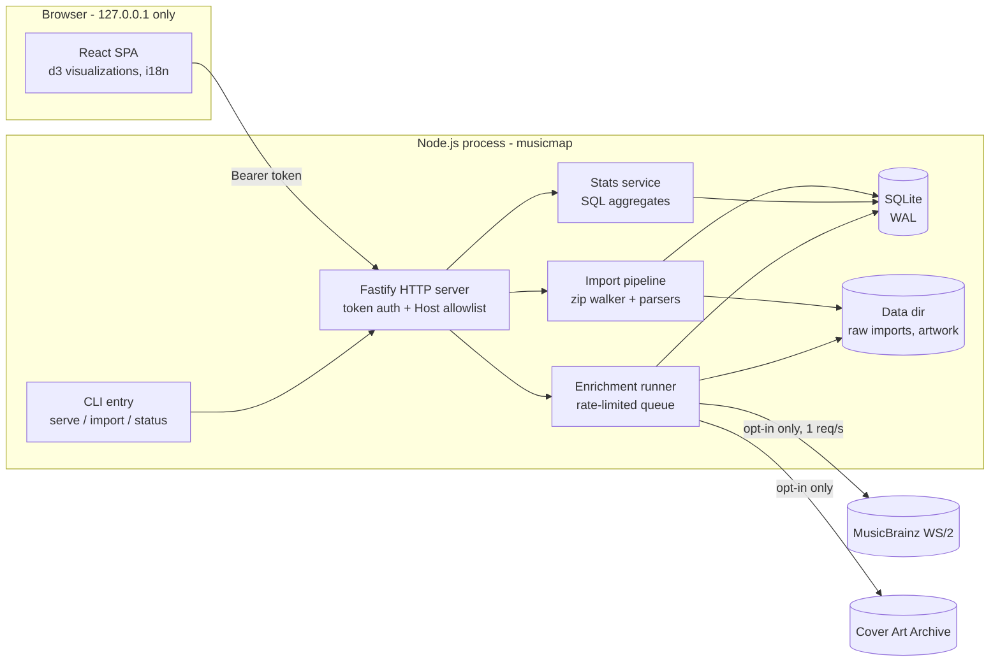

# musicmap — Design Document

Status: v1 design, frozen 2026-07-10 (requirements confirmed with product owner).
Language note: this document is the canonical design source of truth. Issues in `docs/issues/`
are derived from it. Decision records live in `docs/decisions/`, external research in
`docs/research/`.

---

## 1. Product Overview

**musicmap** turns personal music playback history into a browsable "musical autobiography"
(音楽の自分史). Users export their listening history from streaming services, import the files
into a locally running web app, and explore their listening life through four visualizations:

1. **Timeline autobiography** — a chronological, chaptered story of listening periods.
2. **Trends streamgraph** — artist/genre listening volume over time.
3. **Wrapped-style annual report** — per-year summary cards.
4. **Genre map** — the user's personal musical territory as a 2D map.

Core properties:

- **Local-first**: all history data stays on the user's machine (ADR-001).
- **File-export ingestion**: Spotify / Apple Music / YouTube Music data exports; no vendor API
  access for history (ADR-002).
- **Opt-in enrichment**: genres/artwork from MusicBrainz + Cover Art Archive, off by default
  (ADR-003).
- **OSS**: public repository, MIT license, security-first defaults (§13).

### 1.1 Primary persona & use cases

A single individual (developer-adjacent comfortable running `npx`/`npm` commands) with 3-15
years of listening history across up to three services, on macOS/Linux/Windows.

| # | Use case |
|---|---|
| U1 | Import one or more service exports and see one merged history |
| U2 | Scroll through the timeline; annotate life periods as chapters ("college years") |
| U3 | See how artist/genre tastes shifted over the years |
| U4 | Open a year's "wrapped" report for nostalgia / sharing a screenshot |
| U5 | Enable enrichment and explore the personal genre map |
| U6 | Re-import a newer export without duplicating history |

## 2. Scope

### 2.1 v1 Goals

| ID | Goal |
|---|---|
| G1 | Import Spotify Extended Streaming History (ZIP or JSON files) |
| G2 | Import Apple Music `Play Activity.csv` (+ `Play History Daily Tracks.csv` fallback) |
| G3 | Import YouTube Music history from Google Takeout `watch-history.json` (JSON format, ZIP or bare) |
| G4 | Idempotent re-imports; import management (list/delete) with reports |
| G5 | Unified canonical event store (SQLite) with cross-source track/artist identity |
| G6 | Timeline view with manual chapters (CRUD) |
| G7 | Trends streamgraph (artist mode always; genre mode when enriched) |
| G8 | Wrapped annual report per year |
| G9 | Genre map from opt-in MusicBrainz enrichment |
| G10 | i18n UI: English + Japanese from v1 |
| G11 | Localhost security model per ADR-004; secure defaults throughout |
| G12 | Installable OSS package: `git clone && npm install && npm run build && npm start`, plus `npm pack` sanity |

### 2.2 v1 Non-goals

- Hosted/multi-user service; any non-loopback network listener.
- Vendor API history sync (OAuth), realtime scrobbling.
- User-provided API keys (Last.fm, Spotify Web API, ListenBrainz token).
- Automatic chapter detection (change-point analysis).
- Podcast/audiobook analytics (music only).
- Image/PNG export of reports (browser print is the v1 answer).
- Mobile-optimized layouts (desktop-first; must not break at 1024px width).
- npm registry publication (release workflow is drafted but publishing is a human act).

### 2.3 Deferred to v2 (explicitly)

Last.fm scrobble import; ListenBrainz token enrichment; Spotify basic "Account data" JSON;
automatic chapter suggestion; playlist/library import from Takeout/Apple; artwork-rich timeline;
shareable image export; auto-update checks (privacy-reviewed); `node:sqlite` migration;
Tauri desktop shell.

## 3. Architecture Overview

### 3.1 Components



### 3.2 Repository layout (single package, ESM, TS strict)

```
musicmap/
├── package.json            # name musicmap, bin.musicmap = dist/cli/index.js, engines.node >=24
├── tsconfig.json           # strict, NodeNext, outDir dist (server/cli/core code)
├── vite.config.ts          # root src/web, build.outDir dist/web
├── vitest.config.ts
├── playwright.config.ts
├── eslint.config.js        # flat config
├── src/
│   ├── cli/index.ts        # commander: serve | import | status
│   ├── server/
│   │   ├── app.ts          # buildApp(deps) -> Fastify instance (testable factory)
│   │   ├── index.ts        # listen bootstrap (loopback only)
│   │   ├── security/       # token, host allowlist, headers (ADR-004)
│   │   └── routes/         # imports.ts, stats.ts, chapters.ts, settings.ts, enrichment.ts, artwork.ts
│   ├── core/               # PURE: no I/O, no fastify, no db imports
│   │   ├── types.ts        # CanonicalPlayEvent, ImportReport, ...
│   │   ├── normalize.ts    # name/title normalization
│   │   ├── hash.ts         # event hash (§6.5)
│   │   └── errors.ts       # error codes
│   ├── importers/
│   │   ├── framework.ts    # ImportSource interface, orchestration
│   │   ├── archive.ts      # zip entry iterator (yauzl) with safety caps
│   │   ├── spotify.ts
│   │   ├── apple.ts
│   │   └── youtube.ts
│   ├── db/
│   │   ├── connection.ts   # open, pragmas, migrate on open
│   │   ├── migrations/001_init.sql ...
│   │   └── queries/        # imports.ts, events.ts, identity.ts, stats.ts, chapters.ts, settings.ts, enrichment.ts
│   ├── enrichment/
│   │   ├── musicbrainz.ts  # client w/ rate limiter
│   │   ├── coverart.ts
│   │   └── runner.ts       # job FSM
│   └── web/                # Vite root
│       ├── index.html
│       ├── main.tsx
│       ├── api/client.ts   # fetch wrapper w/ bearer token
│       ├── i18n/{en,ja}/*.json
│       ├── pages/          # Overview, Import, Timeline, Trends, Wrapped, GenreMap, Settings
│       └── components/
├── fixtures/               # committed small export fixtures + generator output dir (gitignored)
├── scripts/generate-fixtures.ts
└── docs/
```

Import-boundary rules (enforced by eslint `no-restricted-imports` config):
`core` imports nothing from other layers; `importers`/`db`/`enrichment` may import `core`;
`server` may import all non-web layers; `web` imports nothing from server layers (types shared
via `src/core/types.ts` only).

### 3.3 Runtime modes

| Mode | How | Notes |
|---|---|---|
| Production | `musicmap serve` → Fastify serves `/api` + static `dist/web` | Single origin `http://127.0.0.1:4949` |
| Development | `npm run dev` = concurrently: `tsx watch src/server/index.ts` (port 4949) + `vite` (5173) with proxy `/api` → 4949 | Token check active in dev too |
| Headless import | `musicmap import <file> --source spotify\|apple\|ytm` | Same pipeline, no server |

Build: `npm run build` = `tsc -p tsconfig.json` (server/cli) + `vite build` (web). Tests:
`npm test` (vitest), `npm run e2e` (playwright).

## 4. Technology Stack (pinned majors)

Implementation agents MUST NOT introduce dependencies beyond this list without an escalation
note in the PR description.

| Area | Choice | Major |
|---|---|---|
| Runtime | Node.js | >= 24 (Active LTS) |
| Language | TypeScript, strict, ESM | 5.x |
| HTTP | fastify, @fastify/static, @fastify/multipart | 5.x |
| DB | better-sqlite3 | 12.x |
| Validation | zod | 4.x (3.x acceptable if 4 unavailable) |
| CLI | commander | 14.x |
| Paths | env-paths | 3.x |
| Logging | pino (+pino-pretty dev) | 9.x |
| ZIP | yauzl | 3.x |
| JSON streaming | stream-json | 1.x |
| CSV | csv-parse | 6.x |
| Browser open | open | 10.x |
| UI | react, react-dom | 19.x |
| Routing | react-router-dom | 7.x |
| i18n | i18next, react-i18next | latest stable |
| Viz | d3-scale, d3-shape, d3-force, d3-zoom, d3-selection, d3-array | 3-4.x per package |
| Build | vite, @vitejs/plugin-react | 7.x |
| Test | vitest, playwright, undici (MockAgent, devDep), @testing-library/react + jsdom (devDeps, web component tests), yazl (devDep, fixture ZIP writing only) | latest stable |
| Lint/format | eslint flat + typescript-eslint, prettier, eslint-plugin-i18next (devDep, literal-string rule §10.3) | latest stable |

HTTP client for enrichment: **global `fetch`** (Node built-in undici) — no axios.
Dates: **no date library**; UTC ISO strings in storage, `Intl.DateTimeFormat` with an explicit
`timeZone` for bucketing/formatting (§8.2).

## 5. Data Model

SQLite, WAL mode, `PRAGMA foreign_keys = ON`. All timestamps are ISO 8601 UTC strings
(`YYYY-MM-DDTHH:MM:SSZ`) unless stated. Migration `001_init.sql`:

```sql
-- schema_migrations is created and owned by the migration runner itself,
-- NOT part of 001_init.sql (which contains everything below it):
CREATE TABLE schema_migrations (
  version     INTEGER PRIMARY KEY,
  name        TEXT NOT NULL,
  applied_at  TEXT NOT NULL
);

CREATE TABLE imports (
  id                TEXT PRIMARY KEY,            -- UUID v4
  source            TEXT NOT NULL CHECK (source IN ('spotify','apple_music','youtube_music')),
  status            TEXT NOT NULL CHECK (status IN ('uploaded','parsing','completed','failed')),
  original_filename TEXT NOT NULL,
  file_sha256       TEXT NOT NULL,
  raw_path          TEXT,                        -- relative to data dir, e.g. imports/<id>/original.zip
  created_at        TEXT NOT NULL,
  finished_at       TEXT,
  report_json       TEXT,                        -- ImportReport (§6.6)
  error_json        TEXT                         -- { code, message, details? }
);
CREATE INDEX idx_imports_source ON imports(source);

CREATE TABLE artists (
  id         INTEGER PRIMARY KEY,
  name       TEXT NOT NULL,                      -- display name: first-seen raw form
  norm_name  TEXT NOT NULL UNIQUE                -- §7.1 normalization key
);

CREATE TABLE tracks (
  id               INTEGER PRIMARY KEY,
  artist_id        INTEGER NOT NULL REFERENCES artists(id),
  title            TEXT NOT NULL,                -- display title: first-seen raw form
  norm_title       TEXT NOT NULL,
  album            TEXT,                         -- first non-null seen (Spotify only in v1)
  spotify_track_uri TEXT,                        -- first seen source-native ids (nullable)
  youtube_video_id  TEXT,
  UNIQUE (artist_id, norm_title)
);
CREATE INDEX idx_tracks_artist ON tracks(artist_id);

CREATE TABLE play_events (
  id                   INTEGER PRIMARY KEY,
  import_id            TEXT NOT NULL REFERENCES imports(id) ON DELETE CASCADE,
  source               TEXT NOT NULL CHECK (source IN ('spotify','apple_music','youtube_music')),
  track_id             INTEGER NOT NULL REFERENCES tracks(id),
  played_at            TEXT NOT NULL,            -- UTC; for precision='day': YYYY-MM-DDT00:00:00Z
  played_at_precision  TEXT NOT NULL DEFAULT 'second' CHECK (played_at_precision IN ('second','day')),
  ms_played            INTEGER,                  -- NULL = unknown (YouTube Music)
  play_count           INTEGER NOT NULL DEFAULT 1,  -- >1 only for day-precision aggregate rows
  event_hash           TEXT NOT NULL UNIQUE,     -- §6.5
  raw_meta_json        TEXT                      -- small source extras: {reason_end?, platform?, event_type?, utc_offset_seconds?, apple_genre?}
);
CREATE INDEX idx_events_played_at ON play_events(played_at);
CREATE INDEX idx_events_track     ON play_events(track_id);
CREATE INDEX idx_events_import    ON play_events(import_id);

CREATE TABLE chapters (
  id         INTEGER PRIMARY KEY,
  title      TEXT NOT NULL CHECK (length(title) BETWEEN 1 AND 80),
  starts_on  TEXT NOT NULL,                      -- date, YYYY-MM-DD (local semantic, no tz)
  ends_on    TEXT,                               -- NULL = ongoing; must be >= starts_on when set
  color      TEXT NOT NULL DEFAULT 'auto',       -- palette key: auto|red|orange|amber|green|teal|blue|violet|pink|gray
  note       TEXT CHECK (note IS NULL OR length(note) <= 2000),
  created_at TEXT NOT NULL,
  updated_at TEXT NOT NULL
);

CREATE TABLE settings (
  key        TEXT PRIMARY KEY,                   -- §17.2 registry
  value_json TEXT NOT NULL,
  updated_at TEXT NOT NULL
);

CREATE TABLE artist_enrichment (
  artist_id       INTEGER PRIMARY KEY REFERENCES artists(id) ON DELETE CASCADE,
  status          TEXT NOT NULL CHECK (status IN ('pending','matched','unmatched','failed')),
  mbid            TEXT,
  match_score     INTEGER,
  attempts        INTEGER NOT NULL DEFAULT 0,
  last_attempt_at TEXT,
  fetched_at      TEXT
);

CREATE TABLE genres (
  id   INTEGER PRIMARY KEY,
  name TEXT NOT NULL UNIQUE                      -- MusicBrainz genre, lowercased
);

CREATE TABLE artist_genres (
  artist_id INTEGER NOT NULL REFERENCES artists(id) ON DELETE CASCADE,
  genre_id  INTEGER NOT NULL REFERENCES genres(id),
  votes     INTEGER NOT NULL DEFAULT 0,          -- MusicBrainz genre count value
  PRIMARY KEY (artist_id, genre_id)
);

CREATE TABLE artwork (
  id                  INTEGER PRIMARY KEY,
  artist_norm         TEXT NOT NULL,
  album_norm          TEXT NOT NULL,
  release_group_mbid  TEXT,
  status              TEXT NOT NULL CHECK (status IN ('pending','fetched','not_found','failed')),
  file_path           TEXT,                      -- relative: artwork/<id>.jpg
  fetched_at          TEXT,
  UNIQUE (artist_norm, album_norm)
);

-- Derived caches (§8.4). Rebuilt transactionally; never authoritative.
CREATE TABLE agg_monthly_artist (
  bucket    TEXT NOT NULL,                       -- 'YYYY-MM' in the display timezone
  artist_id INTEGER NOT NULL REFERENCES artists(id) ON DELETE CASCADE,
  plays     INTEGER NOT NULL,
  ms_played INTEGER NOT NULL,                    -- sum over non-NULL only
  PRIMARY KEY (bucket, artist_id)
);
CREATE TABLE agg_meta (
  key   TEXT PRIMARY KEY,                        -- 'timezone', 'built_at', 'events_max_id'
  value TEXT NOT NULL
);
```

Notes:

- `agg_monthly_genre` is NOT a table: genre aggregates join `agg_monthly_artist` with
  `artist_genres` at query time (genres change during enrichment; artists don't).
- Deleting an import cascades its events; an **identity GC** then removes orphaned
  tracks/artists (and their enrichment rows via cascade) — §7.3.
- DB file: `<dataDir>/musicmap.db`. Raw uploads under `<dataDir>/imports/<importId>/`.

## 6. Import Pipeline

### 6.1 Upload & lifecycle state machine

```
(client uploads)         parse OK                   .
POST /api/imports ──► uploaded ──► parsing ──► completed
                                      │
                                      └───────► failed
DELETE /api/imports/:id  : allowed in {completed, failed, uploaded(queued — not yet
                           started)}; removes events (cascade), raw files, then runs
                           identity GC and agg rebuild. Rejected (409) only while parsing.
```

| Transition | Trigger | Side effects |
|---|---|---|
| → uploaded | multipart stream fully written to `imports/<id>/original.<ext>`, sha256 computed | duplicate check: if another import with same `file_sha256` + `source` is in `{uploaded,parsing,completed}` → reject `409 ERR_DUPLICATE_UPLOAD` |
| uploaded → parsing | orchestrator picks job (single worker; FIFO) | progress fields initialized |
| parsing → completed | all recognized files parsed | `report_json` written; agg rebuild (§8.4); `finished_at` set |
| parsing → failed | fatal error (§6.7) | inserted events of this import are deleted; `error_json` set |

Progress is polled via `GET /api/imports/:id` (§9). The server processes **one import at a
time**; additional uploads queue in `uploaded` state.

### 6.2 Accepted upload shapes

| Source | Accepted files |
|---|---|
| spotify | ZIP (the export as downloaded) OR one/many `*.json` history files |
| apple_music | ZIP OR `Apple Music Play Activity.csv` OR `Apple Music - Play History Daily Tracks.csv` |
| youtube_music | ZIP (Takeout) OR `watch-history.json` |

Multipart limits: max 1 file per request, max size 4 GiB (`ERR_UPLOAD_TOO_LARGE`),
`fields: 5`. Multiple loose files = multiple sequential uploads to the same source (each is
its own import).

### 6.3 Archive handling (`src/importers/archive.ts`)

- yauzl streaming iterator; **entries are never extracted to disk** — parsers consume entry
  streams directly. Entry names are matched, never used as filesystem paths (kills zip-slip).
- Safety caps (constants, single module): maxEntries 10,000; per-entry uncompressed 2 GiB;
  total uncompressed 6 GiB; compression ratio > 1,200 with entry > 10 MiB → `ERR_ARCHIVE_BOMB`;
  encrypted entries → `ERR_ARCHIVE_ENCRYPTED`; nested `.zip` entries are skipped with a warning.
- Each source's file-selector predicate picks candidate entries by name pattern AND sniffed
  content shape (first bytes), per research docs.

### 6.4 Parser contract

```ts
interface ImportSourceParser {
  source: 'spotify' | 'apple_music' | 'youtube_music';
  /** Decide if an entry (name + peek bytes) is a data file for this source. */
  matches(entryName: string, peek: Buffer): boolean;
  /** Stream-parse one file, yielding canonical events and per-row skips. */
  parse(file: ReadableStream, ctx: ParseContext): AsyncIterable<ParsedRow>;
}
type ParsedRow =
  | { kind: 'event'; event: CanonicalPlayEvent }
  | { kind: 'skip'; reason: SkipReason }        // 'podcast'|'audiobook'|'video'|'ad'|'non_audio'|'deleted'|'invalid'|'title_unparsed'|'zero_ms'
  | { kind: 'warning'; code: string; detail: string };

interface CanonicalPlayEvent {
  source: Source;
  playedAt: string;               // ISO UTC
  precision: 'second' | 'day';
  artistName: string;             // raw display form
  trackTitle: string;             // raw display form
  album?: string;
  msPlayed?: number;              // omit when unknown
  playCount: number;              // 1 unless day-aggregate
  nativeIds?: { spotifyTrackUri?: string; youtubeVideoId?: string };
  rawMeta?: Record<string, string | number | boolean>;  // whitelisted keys only (§5 raw_meta_json)
}
```

Per-source mapping rules are specified in `docs/research/*.md` and restated as tables in the
parser issues (10-12). Common rules:

- Rows missing artist or title after trimming → `skip:invalid` (except YTM deleted-video rule).
- `ms_played = 0` rows import normally (they are real "skipped instantly" signals) BUT
  Spotify rows with `ms_played = 0` AND null track fields → `skip:invalid`.
- PII fields (IPs, device ids, account ids, user agents) are **never** copied into
  `CanonicalPlayEvent`.
- Parsers must be pure per-file streams: no DB access (framework owns persistence).

### 6.5 Idempotency: event hash

```
precision 'second':
  event_hash = sha256(source | playedAt | 's' | norm(artist) | normTitle(title) | msPlayed ?? '-')
precision 'day':
  event_hash = sha256(source | playedAt | 'd' | norm(artist) | normTitle(title))
-- normTitle (not norm) is intentional: dedupe identity must match track identity (§7.2),
-- so "Song" and "Song (feat. X)" hash identically.
```

Insert policy: `INSERT ... ON CONFLICT(event_hash) DO NOTHING` for second-precision;
for day-precision, `DO UPDATE SET play_count = MAX(play_count, excluded.play_count),
ms_played = MAX(COALESCE(ms_played,0), COALESCE(excluded.ms_played,0))` (a newer export of the
same day supersedes a partial-day snapshot). Duplicate counts are recorded in the report.

### 6.6 ImportReport (stored as `report_json`)

```json
{
  "files": [
    { "name": "Streaming_History_Audio_2019_3.json",
      "rowsTotal": 10432, "eventsImported": 10101, "duplicates": 200,
      "skipped": { "podcast": 118, "invalid": 13 } }
  ],
  "totals": { "eventsImported": 55210, "duplicates": 1200, "skipped": { "ad": 40 },
              "artistsCreated": 812, "tracksCreated": 4120,
              "earliestPlayedAt": "2015-02-01T09:00:00Z", "latestPlayedAt": "2026-06-30T23:59:59Z" },
  "warnings": [ { "code": "W_UNKNOWN_FIELDS", "detail": "audiobook_uri present; ignored" } ]
}
```

### 6.7 Error taxonomy (fatal → `failed`)

`ERR_UPLOAD_TOO_LARGE`, `ERR_ARCHIVE_ENCRYPTED`, `ERR_ARCHIVE_BOMB`, `ERR_ARCHIVE_CORRUPT`,
`ERR_NO_RECOGNIZED_FILES` (nothing matched the source's selector — includes "wrong source
chosen" guidance and the list of top-level entry names found), `ERR_SCHEMA_MISMATCH` (matched
file but headers/fields unusable; details list expected vs found), `ERR_DISK_FULL`, `ERR_DB`,
`ERR_INTERNAL`. Per-row problems are never fatal: they become `skip`/`warning` entries, capped
at 1,000 stored detail items (counters always exact).

### 6.8 Write path & performance

Events buffered and flushed in prepared-statement transactions of 5,000 rows; identity
resolution (§7) runs in the same transaction via in-memory caches. Progress = bytes consumed of
total upload size + per-file counters, updated at flush boundaries.

## 7. Identity Resolution

### 7.1 Normalization (`src/core/normalize.ts`)

`norm(s)` pipeline (locale-independent, deterministic, tested by golden table; the golden
tests in issue 05 are normative for edge cases):

1. Unicode NFKC → 2. lowercase (locale-independent) → 3. NFKD, strip combining marks
(diacritics) → 4. strip zero-width chars → 5. map typographic quotes/dashes to ASCII →
6. collapse internal whitespace to single space + trim.

`normTitle(s)` additionally strips ONE trailing parenthetical/bracket group matching
`/\s*[(\[](feat\.|ft\.|with\s|prod\.).*[)\]]$/i` (display title keeps it).

Explicit non-goals of v1 normalization (documented limitation): splitting multi-artist strings
("A & B", "A feat. B" as artist), romaji↔kana unification, "The " prefix handling.

### 7.2 Upsert flow (inside import transaction)

```
artist_id = SELECT id FROM artists WHERE norm_name = norm(artistName)
         ?? INSERT artists(name = raw artistName, norm_name)
track_id  = SELECT id FROM tracks WHERE artist_id = ? AND norm_title = normTitle(trackTitle)
         ?? INSERT tracks(artist_id, title = raw, norm_title, album?, native ids?)
on existing track: fill album / spotify_track_uri / youtube_video_id if currently NULL
```

In-memory `Map<string, number>` caches make this O(1) per row within an import.

### 7.3 Identity GC (after import deletion)

`DELETE FROM tracks WHERE id NOT IN (SELECT DISTINCT track_id FROM play_events)` then
`DELETE FROM artists WHERE id NOT IN (SELECT DISTINCT artist_id FROM tracks)`; then agg rebuild.
Runs in the same transaction as the import-row deletion.

## 8. Stats & Metrics Layer

### 8.1 Metric definitions

| Metric | Definition |
|---|---|
| `plays` | `SUM(play_count)` over selected events |
| `minutes` | `SUM(ms_played)/60000.0` over events with `ms_played IS NOT NULL`, rounded for display |
| Duration coverage | Per-scope % of plays that carry `ms_played` — surfaced wherever `minutes` is shown and coverage < 100% ("minutes exclude YouTube Music" badge) |
| First played (discovery) | `MIN(played_at)` per artist/track across all data |
| Listening clock | plays histogram by local hour-of-day, **excluding** `precision='day'` events |
| Source coverage | per source: min/max `played_at` + monthly event counts (gap detection) |

### 8.2 Time bucketing policy

- Storage is always UTC. Bucketing/display uses ONE configured IANA timezone
  (`display.timezone`, default: server's system timezone at first run, persisted).
- Bucket keys: month `YYYY-MM`, year `YYYY`, computed via `Intl.DateTimeFormat('en-CA',
  { timeZone, year, month, day, hour })` `formatToParts` — no date library.
- Apple per-event `UTC Offset In Seconds` is stored in `raw_meta_json` but NOT used in v1
  bucketing (single-timezone policy; documented limitation).
- Changing `display.timezone` invalidates agg caches (§8.4).

### 8.3 Query surface (typed service functions in `src/db/queries/stats.ts`)

`getOverview()`, `getTimeline(bucket, from?, to?, topN)`, `getTrends(mode, from?, to?, topN)`,
`getWrappedYears()`, `getWrapped(year)`, `getGenreMapData(from?, to?)` — exact response shapes
in §9. All read from `play_events`/`agg_monthly_artist`; every function has golden-number tests
against the committed fixture dataset.

### 8.4 Aggregate cache

`agg_monthly_artist` rebuilt by one `DELETE` + batched `INSERT`s of sums grouped by
TS-computed bucket keys (NOT SQLite `strftime` — SQLite has no timezone database) whenever:
an import completes, an import is deleted, or `display.timezone` changes.
Bucket computation for the rebuild happens in TS (Intl) via an events scan batched at 50k
rows — SQLite has no tz database, so buckets are computed application-side and written to the
cache. `agg_meta` records `{timezone, built_at, events_max_id}`; on server start, mismatch →
rebuild. Rebuild of 1M events target: < 20 s (§15).

## 9. HTTP API Contract

Common: base `http://127.0.0.1:<port>`; all `/api/*` require `Authorization: Bearer <token>`
(§13.3) except `GET /api/health`. Responses `application/json; charset=utf-8`. Errors:

```json
{ "error": { "code": "ERR_SCHEMA_MISMATCH", "message": "human-readable EN", "details": {} } }
```

(HTTP status: 400 validation, 401 auth, 403 host, 404, 409 conflict, 413 too large, 500.)
Client maps `code` → localized message; `message` is a developer aid only.

| Method & path | Purpose | Notes |
|---|---|---|
| GET `/api/health` | liveness | `{ ok: true, version }`, no auth |
| GET `/api/auth-check` | token validation for the SPA boot handshake | `204`; token-protected, no body |
| GET `/api/overview` | dashboard | totals, per-source coverage, enrichment summary |
| POST `/api/imports` | upload | multipart fields: `source`, `file`; → `202 { id }` |
| GET `/api/imports` | list | newest first |
| GET `/api/imports/:id` | detail+progress | includes `progress` while parsing |
| DELETE `/api/imports/:id` | delete import+events | 409 while `parsing` |
| GET `/api/timeline?bucket=month&from&to&topN=3&metric=plays` | timeline data | §11.1 |
| GET `/api/chapters` / POST / PATCH `/:id` / DELETE `/:id` | chapters CRUD | zod-validated (§11.1) |
| GET `/api/trends?mode=artist\|genre&from&to&topN=10&metric=plays` | streamgraph series | §11.2 |
| GET `/api/wrapped` | available years | `{ years: [2015, ...] }` |
| GET `/api/wrapped/:year` | annual report payload | §11.3 |
| GET `/api/genre-map?from&to&metric=plays` | nodes+edges+top artists | §11.4; always 200 (cached genres stay useful after disabling) — the UI gates via enrichment status |
| GET `/api/settings` / PATCH `/api/settings` | settings registry | §17.2; PATCH validates keys |
| GET `/api/enrichment/status` | job + counts | §12.4 |
| POST `/api/enrichment/start` / `pause` | control | start requires `enrichment.enabled=true` |
| GET `/api/enrichment/delete-summary` | counts shown before deleting enrichment data | `{ artistEnrichment, artistGenres, genres, artworkRows, artworkFiles }` |
| POST `/api/enrichment/delete-data` | truncate enrichment tables + artwork files | 409 unless `enrichment.enabled=false`; idempotent (§12.2) |
| GET `/api/artwork/:id` | cached image file | immutable cache headers; 404 if not fetched |

Representative payloads:

```jsonc
// GET /api/timeline?bucket=month&topN=3&metric=plays
{ "timezone": "Asia/Tokyo", "metric": "plays",
  "buckets": [ { "bucket": "2019-03", "plays": 812, "minutes": 2410, "durationCoverage": 0.62,
    "topArtists": [ { "artistId": 12, "name": "ヨルシカ", "plays": 120, "minutes": 380 } ],
    "topTracks": [ { "trackId": 501, "title": "ただ君に晴れ", "artistName": "ヨルシカ", "plays": 44 } ] } ] }
// topArtists/topTracks both carry topN entries; the month row renders topTracks[0] and the
// first 3 topArtists, the inline expansion renders the full lists (§11.1) — one fetch per view.

// GET /api/trends?mode=artist&topN=10
{ "mode": "artist", "metric": "plays", "buckets": ["2018-01", "2018-02"],
  "series": [ { "id": 12, "name": "ヨルシカ", "values": [30, 55] },
              { "id": -1, "name": "__other__", "values": [200, 180] } ] }

// GET /api/genre-map
{ "metric": "plays", "totalWeight": 51200, "unknownWeight": 8100,
  "nodes": [ { "genreId": 3, "name": "shoegaze", "weight": 900,
               "topArtists": [ { "artistId": 12, "name": "...", "weight": 300 } ] } ],
  "edges": [ { "a": 3, "b": 7, "weight": 410 } ] }
```

Full request/response schemas live beside the route code as zod schemas; issues restate the
exact fields per endpoint they implement.

## 10. Web Application

### 10.1 Routes & screens

| Route | Screen | Data |
|---|---|---|
| `/` | Overview dashboard: totals, per-source coverage bars with gaps, enrichment card, quick links; first-run empty state → import CTA | `/api/overview` |
| `/import` | Import wizard: source picker → per-source "how to get your export" guide (i18n) → dropzone → upload/parse progress → report; plus imports list with delete | imports API |
| `/timeline` | Timeline autobiography (§11.1) | timeline + chapters API |
| `/trends` | Streamgraph (§11.2) | trends API |
| `/wrapped` / `/wrapped/:year` | Annual report (§11.3) | wrapped API |
| `/map` | Genre map (§11.4) | genre-map + enrichment API |
| `/settings` | Settings & enrichment consent (§12.2, §17.2) | settings API |

### 10.2 App shell

- Left nav (icons + labels), content area, top bar with date-range picker on viz pages
  (shared component: presets All / Last year / Last 5 years / custom from-to by month).
- Theme: light/dark via CSS custom properties; default follows `prefers-color-scheme`;
  toggle persisted in settings. No CSS framework — hand-rolled tokens file
  (`src/web/styles/tokens.css`) with the small design-token set defined in issue 17.
- States: every data view implements loading (skeleton), error (code-mapped message + retry),
  and empty (guidance + CTA) states — shared primitives.
- Token handshake: on boot, SPA reads `#token=<t>` from `location.hash`, stores to
  `sessionStorage`, strips the fragment via `history.replaceState`, and pings
  `GET /api/auth-check`; 401 → full-screen "open the URL printed by `musicmap serve`"
  instruction page.

### 10.3 i18n

- `i18next` + `react-i18next`; resources `src/web/i18n/{en,ja}/{common,import,timeline,trends,wrapped,map,settings,errors}.json`.
- Language: `settings.locale` = `'auto' | 'en' | 'ja'`; `auto` resolves from
  `navigator.language` (ja* → ja, else en).
- ALL user-visible strings go through `t()` — enforced by review checklist + an eslint rule
  (`i18next/no-literal-string`) on `src/web/**` (warnings allowed only in tests).
- Dates/numbers formatted with `Intl.*` using the active locale and `display.timezone`.
- Error codes (§9) map to `errors.json` entries; unknown codes fall back to generic + code.

## 11. Visualization Specs

Shared: d3 computes geometry; React renders SVG elements (no d3 DOM mutation except zoom
behaviors). Colors from a fixed 10-color categorical palette (defined in tokens.css, AA-checked
on both themes). All charts responsive to container width (ResizeObserver hook), min supported
width 1024px viewport.

### 11.1 Timeline autobiography (`/timeline`)

Layout: vertical, chronological (oldest at top). Left rail = chapters; main column = month rows
grouped under sticky year headers.

- Month row: `YYYY-MM` label, horizontal bar (metric value, scaled to the max month in range),
  top-3 artist chips, top-track line. Clicking a month expands an inline panel: top-10
  artists/tracks table for that month (fetched from `/api/timeline?bucket=month&topN=10`
  response — same payload, no extra endpoint; expansion uses already-loaded data).
- Empty months render as thin gap markers (coverage honesty).
- Year header: year totals + mini source-coverage strip.
- Metric toggle (plays/minutes) top-right; duration-coverage badge when < 100%.
- Chapters rail: colored vertical spans covering `starts_on..ends_on` aligned to month rows;
  label rotated 0°, truncated at 24 chars with tooltip. Overlapping chapters stack into
  parallel sub-lanes (max 3 lanes; further overlaps merge visually with a "+n" chip).
- Chapter editing: "Add chapter" button + click-drag on the rail to preselect a range → modal
  (title required, dates, color from palette, note). Edit/delete via chapter click → same modal.
  Validation errors shown inline (end >= start, title length).
- Deep links: `/timeline?from=2018-01&to=2020-12`.

### 11.2 Trends streamgraph (`/trends`)

- d3 `stack` with `stackOffsetWiggle` + `stackOrderInsideOut`, month buckets from the trends
  API; `curveBasis` smoothing; series = top-N (default 10) + `__other__` (rendered gray,
  always bottom via explicit order exception, excluded from legend toggle).
- Mode toggle: Artist | Genre. Genre mode when enrichment has ≥1 matched artist; otherwise the
  toggle is disabled with a tooltip + CTA link to `/settings#enrichment`. `__unknown__` genre
  series (from unmatched artists' weight) renders hatched gray.
- Interactions: hover → vertical guide + tooltip (bucket, series, value, % of bucket); click a
  legend item → toggle series visibility (recomputes stack without it); metric toggle
  (plays/minutes); date-range picker.
- Axis: x = time (year ticks), y = hidden (streamgraph is proportional; absolute scale shown in
  tooltip only). Reduced-motion: no entry animation when `prefers-reduced-motion`.

### 11.3 Wrapped annual report (`/wrapped/:year`)

Year selector = years from `GET /api/wrapped`. One API payload renders a card grid:

| Card | Content |
|---|---|
| Hero | year, total plays, total minutes (+coverage badge), distinct artists/tracks |
| Top artists | top 5 by metric: rank, name, plays, minutes, artwork thumb when available |
| Top tracks | top 5: rank, title, artist, plays |
| Top genres | top 3 genres by weight (only when enrichment has data; card hidden otherwise) |
| Listening clock | 24-bar radial/columns histogram (hour of day, `precision='second'` only) |
| Firsts & records | first play of year, last play, busiest day (date + plays), longest track binge (max same-track plays in a day) |
| New discoveries | count of artists whose global first play falls in this year + top 3 of them |
| Sources | per-source share of plays this year (stacked bar) |

Print stylesheet (`@media print`): cards flow onto A4, nav hidden — this is the v1 "export".

### 11.4 Genre map (`/map`)

- Data: `GET /api/genre-map` (§9) — server computes nodes (top 150 genres by weight in range),
  edges (per-artist genre-pair co-occurrence, §ADR-005), top-10 artists per node, and the
  unknown-weight share; client computes layout.
- Layout: d3-force (`forceLink` distance ∝ 1/weight, `forceManyBody` charge -80,
  `forceCollide` radius+2) with **seeded PRNG** (mulberry32 of a constant) and fixed 300 ticks
  run synchronously before first paint; positions cached in `sessionStorage` keyed by the
  FNV-1a hash above.
- Rendering: SVG; node = circle (r = sqrt-scaled weight, 6-40px) + label (hidden below zoom
  0.8 except top-20 nodes); edge = line, opacity ∝ weight, only edges kept by pruning rule
  (top-4 per node union). Pan/zoom via d3-zoom (0.3–4×). Layout-position cache key: a stable
  synchronous content hash (FNV-1a) of the ordered `(genreId, weight)` list.
- Interactions: hover → tooltip (genre, weight, % of total); click → right side panel: genre
  name, weight, top-10 artists with per-artist weight; "unknown" share shown as a fixed panel
  chip ("n% of listening has no genre data yet").
- States: enrichment disabled → full-screen explainer + consent CTA; enrichment running with
  <10 matched artists → progress state; genre-less range → empty state.
- Date-range picker re-fetches; layout re-runs only when the node-set hash changes.

## 12. Enrichment Subsystem

### 12.1 Scope

Artist → MBID + genres (all matched artists), and release-group artwork for wrapped top-artist
thumbnails (bounded: for each wrapped year's top-5 artists, only that artist's most-played
non-null album of the year — the album wrapped actually renders; max 200 artwork rows total,
recent years first). Track-level enrichment is v2.

### 12.2 Consent & settings

`enrichment.enabled` (default `false`). The settings screen shows, before enabling:
what is sent (artist names, album titles), to whom (MusicBrainz, Cover Art Archive), what is
never sent (timestamps, counts, any history), and cache behavior. Disabling pauses the job and
stops all outbound requests (in-flight request finishes); cached data is kept (a separate
"delete enrichment data" button truncates `artist_enrichment`, `artist_genres`, `genres`,
`artwork` + files).

### 12.3 MusicBrainz client (`src/enrichment/musicbrainz.ts`)

- Global token-bucket: 1 request / 1,100 ms across ALL enrichment traffic (MB + nothing else;
  CAA has its own softer limiter at 2 req/s).
- `User-Agent: musicmap/<version> (+https://github.com/Saber5656/musicmap)`.
- Retry: 503/429 → exponential backoff (2 s, 8 s, 30 s; respect `Retry-After`), then per-item
  `failed` with `attempts++`; network errors likewise. 10 consecutive transport failures →
  job auto-pauses with status reason `network`.
- Response validation via zod; unexpected shapes → item `failed`, never crash the runner.
- Outbound host allowlist enforced in ONE fetch wrapper (`src/enrichment/http.ts`):
  `musicbrainz.org` and `coverartarchive.org` as EXACT host matches; `archive.org` and
  `*.archive.org` (subdomain matching for archive.org only, as redirect targets); redirects
  re-checked hop by hop.

### 12.4 Job runner FSM

```
        start (enabled)                 all done
idle ────────────────► running ────────────────► completed
  ▲                      │   ▲                        │
  │        pause / net-fail│   │resume                │ new artists imported
  └── disabled ◄─────────┘   └── paused ◄────────────┘ → back to idle (pending items exist)
```

- Work order: artists by total plays DESC (most-listened first → map fills meaningfully early).
- Per artist: search → (match policy per ADR-003) → on match, lookup genres → upsert
  `genres`/`artist_genres` → status `matched`; else `unmatched`. All state persisted per item;
  process restart resumes cleanly (job state in `settings` key `enrichment.jobState`).
- `GET /api/enrichment/status` → `{ state, phase: 'artist'|'artwork',
  counts: { pending, matched, unmatched, failed },
  artworkCounts?: { pending, fetched, not_found, failed },
  currentArtist?, etaSeconds? (pending × 1.2s), lastError? }`. `phase` is `'artist'` until
  the artist queue drains, then `'artwork'` (§12.5); `artworkCounts` present once the
  artwork phase exists. UI polls 2 s while running.
- Import completion with new artists sets state `idle→running` automatically ONLY if enabled
  and job was previously `completed` (auto-continue), else waits for user start.

### 12.5 Artwork (CAA)

For each wrapped year's top-5 artists: take the artist's most-played non-null album that year
(the pair wrapped renders, §12.1), resolve the release-group MBID via MB search (counts
against the 1 req/s bucket), then `GET coverartarchive.org/release-group/<mbid>/front-500`
following the 307 to archive.org (re-validated against allowlist), store to
`<dataDir>/artwork/<id>.<ext>` (extension from validated content-type, jpeg|png; max 2 MiB
per image), row status per §5. The artwork phase runs inside the enrichment runner after the
artist phase completes: the runner exposes `phase: 'artist' | 'artwork'` and stays `running`
until both phases finish (§12.4 status payload). `GET /api/artwork/:id` is bearer-protected
like all API routes (the SPA loads it as a Blob) and streams the file with
`Cache-Control: private, max-age=31536000, immutable` plus the global security headers.

## 13. Security Model

### 13.1 Trust boundaries

| # | Boundary | Trust assumption |
|---|---|---|
| B1 | Browser ↔ server (loopback HTTP) | Browser may run hostile web pages; only tokened requests are trusted |
| B2 | Uploaded export files | Fully untrusted input (user may be tricked into importing a crafted file) |
| B3 | Outbound HTTPS (enrichment) | Servers semi-trusted; responses validated; only after opt-in |
| B4 | Data directory | Trusted at OS user level; other local users untrusted → restrictive perms |
| B5 | npm dependencies / CI | Supply chain risk; minimized + audited |

### 13.2 Threat table (v1 controls are mandatory acceptance criteria)

| ID | Threat | Control(s) |
|---|---|---|
| T1 | CSRF from malicious website to localhost API | Bearer token on all `/api` (no cookies) — ADR-004 |
| T2 | DNS rebinding | Host-header allowlist `127.0.0.1:<port>`/`localhost:<port>` on every request |
| T3 | LAN/remote access | Bind 127.0.0.1 only; no `--host` option exists |
| T4 | Zip bomb / decompression exhaustion | §6.3 caps: entries, per-entry, total, ratio |
| T5 | Zip-slip path traversal | Entries never extracted to disk; names never used as paths |
| T6 | Huge/deep JSON, CSV cell abuse | Streaming parsers; 64 KiB max string field, 10 MiB max CSV row, depth cap 20 |
| T7 | Stored XSS via track/artist strings | React escaping only (no `dangerouslySetInnerHTML` — eslint-forbidden); strict CSP (§13.3); titles rendered as text nodes even in SVG (`<text>`) |
| T8 | SQL injection | Prepared statements only; no string-built SQL (eslint `no-restricted-syntax` guard + review) |
| T9 | SSRF / data exfil via enrichment | Single fetch wrapper with host allowlist; redirects re-validated; enrichment off by default |
| T10 | Sensitive data at rest | PII fields dropped at parse (§6.4); data dir `0700`, DB file `0600` (POSIX best-effort); raw uploads documented + deletable in UI |
| T11 | Token leakage | Token in URL **fragment** only (never sent/logged), memory + sessionStorage; constant-time compare; rotated each start; never persisted server-side |
| T12 | Supply chain | Committed lockfile; `npm ci` in CI; `npm audit --omit=dev` + osv-scanner job; Dependabot; §4 dependency allowlist; GitHub Actions pinned to commit SHAs with `permissions: contents: read` |
| T13 | Malicious enrichment responses | zod validation; artwork content-type + size caps; images served from own origin with nosniff |
| T14 | Log leakage | Logs local-only; token/authorization headers redacted by pino serializer; log level default `info` without row-level data |

### 13.3 Security headers (every response)

`Content-Security-Policy: default-src 'self'; script-src 'self'; style-src 'self'; img-src
'self' data: blob:; connect-src 'self'; object-src 'none'; frame-ancestors 'none'; base-uri
'none'; form-action 'self'`, `X-Content-Type-Options: nosniff`, `Referrer-Policy:
no-referrer`, `Cross-Origin-Opener-Policy: same-origin`, `Cross-Origin-Resource-Policy:
same-origin`. (`blob:` in img-src only: artwork images are fetched as Blobs with the bearer
token and rendered via object URLs — §12.5; blob URLs are same-document and not remotely
addressable.) No inline scripts/styles in `index.html` (Vite configured accordingly).

### 13.4 Secrets & release posture

v1 stores no secrets at all. `SECURITY.md` documents: supported versions, private reporting via
GitHub Security Advisories, 90-day disclosure. Release workflow (drafted, manually triggered)
builds, tests, `npm pack`, and attaches provenance notes; actual `npm publish` is a human act
(repo rule: merge ≠ release).

## 14. Failure Modes & Edge Cases

| Scenario | Behavior |
|---|---|
| Wrong source selected for a file | `ERR_NO_RECOGNIZED_FILES` with found-entries list + "did you mean" hint when another source's selector matches |
| Export vintage renamed/added fields | Unknown fields ignored + `W_UNKNOWN_FIELDS` warning; missing required columns → `ERR_SCHEMA_MISMATCH` listing expected vs found |
| Disk full mid-import | Import → `failed`, partial events deleted, actionable message |
| Server killed mid-import | On next start: `parsing`/`uploaded` imports → `failed` with `ERR_INTERRUPTED`; user re-runs (idempotent) |
| Browser closed mid-import | Server continues; `/import` resumes progress display on reopen |
| Port busy | Try `port..port+9`, print chosen; explicit `--port` conflicts → hard error |
| Two server instances | Second instance gets next port + its own token. Write exclusivity via an atomic PID lock file (`O_EXCL` create of `<dataDir>/lock`, stale-PID takeover): the lock is acquired BEFORE writable DB open/migrations/recovery; an instance that cannot acquire it opens the DB read-only, skips migrate/recovery, and serves in read-only-warn mode (imports rejected 409) |
| DB corrupted | `PRAGMA quick_check` on start; on failure: refuse to serve, print recovery steps (backup copy path) |
| Migration failure | Transactional; DB backup copy `musicmap.db.bak-<ts>` made before applying migrations when version increases |
| System clock/timezone change | Buckets derive from stored UTC + configured tz; tz change → agg rebuild (§8.4) |
| Empty library (no imports) | Every page renders guided empty state, no errors |
| Single-source library | All views work; genre/duration badges reflect coverage |
| Enrichment mid-disable | In-flight request completes, no new requests; UI reflects paused-by-disable |
| MusicBrainz down | Backoff → auto-pause `network`; resume button; no data loss |
| Artist with zero matched genres | Counts toward `unknownWeight` in the map and toward the `__unknown__` series in genre trends (§11.2) — never silently dropped |

## 15. Performance Targets (measured by issue 32 against the 1M-event synthetic fixture)

| Operation | Budget |
|---|---|
| Import throughput (Spotify JSON, M-series laptop, warm) | ≥ 8,000 events/s sustained; 1M events ≤ 3 min |
| Peak RSS during 500 MiB upload import | ≤ 1.5 GiB |
| Agg rebuild (1M events) | ≤ 20 s |
| `GET /api/timeline` (10y, month buckets) | p95 ≤ 300 ms |
| `GET /api/trends`, `/api/wrapped/:year`, `/api/genre-map` | p95 ≤ 500 ms |
| SPA cold load (built assets, local) | ≤ 2 s to interactive |
| Genre map layout (150 nodes) | ≤ 1.5 s compute, then cached |

## 16. Testing Strategy

| Layer | Tool | What |
|---|---|---|
| core (normalize, hash) | vitest | golden tables incl. Unicode/ja cases |
| parsers | vitest | committed fixtures per source per vintage; malformed/adversarial fixtures (bomb zip, huge cell, wrong schema) |
| db/queries | vitest + tmp SQLite | migration idempotency; golden numbers for every stats function against `fixtures/mini-library` (~2k events, all 3 sources, known answers) |
| API | vitest + fastify inject | contract tests incl. 401/403/409/413 security cases |
| enrichment | vitest + undici MockAgent | rate limiter timing (fake timers), match policy, FSM transitions, allowlist violations |
| E2E | Playwright | scripted journey: serve → import 3 fixtures → timeline+chapter CRUD → trends → wrapped → enable enrichment (local MB mock server) → genre map renders; axe-core a11y smoke on each page |
| Performance | script (`npm run perf`) | budgets §15; run locally + nightly CI (non-blocking report) |

CI (GitHub Actions): lint, typecheck, unit, build, E2E (ubuntu; macOS unit-only), audit/osv,
`npm pack` install-smoke. All jobs `permissions: contents: read`, actions SHA-pinned.

## 17. Configuration & Data Directory

### 17.1 Resolution order

CLI flag > env var > `config.json` > default.

| Setting | Flag / env | Default |
|---|---|---|
| Port | `--port` / `MUSICMAP_PORT` | 4949 |
| Data dir | `--data-dir` / `MUSICMAP_DATA_DIR` | `env-paths('musicmap').data` |
| Open browser | `--no-open` | open on `serve` |
| Log level | `MUSICMAP_LOG_LEVEL` | `info` |

Per-OS data dir (`env-paths`): macOS `~/Library/Application Support/musicmap`, Linux
`$XDG_DATA_HOME/musicmap`, Windows `%LOCALAPPDATA%\musicmap\Data`. Layout:

```
<dataDir>/
├── musicmap.db (+ -wal/-shm)
├── imports/<importId>/original.<ext>
├── artwork/<id>.jpg
├── logs/musicmap.log        (rotating, 5 × 10 MiB)
└── lock
```

### 17.2 Settings registry (DB `settings` table; all exposed via GET/PATCH `/api/settings`)

| Key | Type / values | Default |
|---|---|---|
| `locale` | `'auto'\|'en'\|'ja'` | `auto` |
| `theme` | `'auto'\|'light'\|'dark'` | `auto` |
| `display.timezone` | IANA tz string | system tz at first run |
| `display.defaultMetric` | `'plays'\|'minutes'` | `plays` |
| `enrichment.enabled` | boolean | `false` |
| `enrichment.jobState` | internal (§12.4) | `idle` |

PATCH validates against this registry (zod discriminated map); unknown keys → 400.

## 18. Known Unknowns (tracked in ISSUE_PLAN; may spawn new issues)

1. Real 2026 export vintages: exact Spotify file naming/fields, Apple current headers &
   Play Activity availability, YTM Japanese-locale `header`/title shapes — parsers are
   alias-tolerant, but fixtures must be corrected against real exports during implementation.
2. d3-force layout quality at 150 nodes (fallback knobs specified in ADR-005).
3. MusicBrainz coverage for Japanese/doujin/Vocaloid artists — unmatched share may be high for
   some libraries; mitigation is honest "unknown" display, but UX may need iteration.
4. better-sqlite3 prebuilt binary availability on all target platforms for Node 24 (else
   node-gyp toolchain becomes an install requirement — documented in README if so).
5. Whether Apple `Play Duration Milliseconds` clamping (§research) distorts minutes for heavy
   Apple users; may need a per-source correction pass.

## 19. Glossary

| Term | Meaning |
|---|---|
| Source | One of `spotify`, `apple_music`, `youtube_music` |
| Play event | One canonical playback record (§6.4); may aggregate a day (`play_count`) |
| Precision | `second` (real timestamp) or `day` (date-only aggregate row) |
| Chapter | User-defined labeled date range shown on the timeline |
| Bucket | Month/year key in the display timezone |
| Enrichment | Opt-in MusicBrainz/CAA metadata fetching (genres, artwork) |
| MBID | MusicBrainz identifier (UUID) |
| Unknown weight | Listening weight of artists without genre data |
| Import report | Per-import statistics + skip/warning breakdown (§6.6) |
| Agg cache | Derived `agg_monthly_artist` table (§8.4) |
