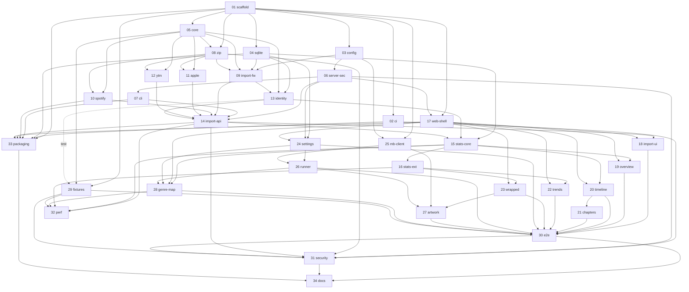

# musicmap — Issue Plan (v1)

Status: derived from `docs/DESIGN.md` (frozen 2026-07-10). GitHub Issues are generated from
`docs/issues/NN-*.md`; when they disagree, these repo-local docs win and GitHub is stale.

## 1. v1 Completion Statement

**When every issue 01-34 below is completed and its Validation section passes, musicmap v1 is
complete**: a locally-run, secure-by-default (ADR-004) web application that imports Spotify /
Apple Music / YouTube Music history exports idempotently (ADR-002), stores them as canonical
events in SQLite (ADR-006), and provides four visualizations — timeline autobiography with
manual chapters, trends streamgraph, wrapped annual reports, and an opt-in-enrichment genre map
(ADR-003, ADR-005) — with an English/Japanese UI, CI, E2E/security/performance validation, and
installable packaging (DESIGN.md §2.1 G1-G12). The only intentional remainders are the v2
deferrals (§7) and newly discovered implementation unknowns (§8).

## 2. Issue Index (recommended execution order)

| # | File | Title | Wave | Depends on | DESIGN refs |
|---|---|---|---|---|---|
| 01 | `01-project-scaffold.md` | Project scaffold: TS/ESM package, lint, test, build skeleton | 1 | — | §3.2, §3.3, §4 |
| 02 | `02-ci-pipeline.md` | CI pipeline and supply-chain guards (GitHub Actions) | 1 | 01 | §4, §13.2 T12, §16 |
| 03 | `03-config-and-paths.md` | Config resolution, data directory, logging | 1 | 01 | §17, §14 |
| 04 | `04-sqlite-and-migrations.md` | SQLite connection, migration runner, schema 001 | 1 | 01 | §5 |
| 05 | `05-core-normalization.md` | Core types, normalization, event hash | 1 | 01 | §6.4, §6.5, §7.1 |
| 06 | `06-server-security-bootstrap.md` | Fastify app factory with localhost security model | 2 | 01, 03 | §9, §13, ADR-004 |
| 07 | `07-cli-serve-status.md` | CLI: `serve` and `status` commands | 2 | 03, 06 | §3.3, §17.1, §14 |
| 08 | `08-zip-ingestion.md` | Safe ZIP entry iterator with resource caps | 2 | 01, 05 | §6.3, §13.2 T4-T5 |
| 09 | `09-import-framework.md` | Import pipeline framework and lifecycle state machine | 2 | 03, 04, 05, 08 | §6.1, §6.2, §6.5-6.8 |
| 10 | `10-parser-spotify.md` | Spotify Extended Streaming History parser | 3 | 05, 08 | §6.4, research/spotify |
| 11 | `11-parser-apple-music.md` | Apple Music Play Activity + Daily Tracks parser | 3 | 05, 08 | §6.4, research/apple |
| 12 | `12-parser-youtube-music.md` | YouTube Music Takeout watch-history parser | 3 | 05, 08 | §6.4, research/youtube |
| 13 | `13-identity-resolution.md` | Artist/track identity upsert and orphan GC | 3 | 04, 05, 09 | §7 |
| 14 | `14-import-api-and-cli.md` | Import HTTP endpoints + `musicmap import` command | 3 | 06, 07, 09, 10, 11, 12, 13 | §6.1-6.2, §9, §14 |
| 15 | `15-stats-core.md` | Stats core: bucketing, agg cache, overview + timeline queries | 4 | 04, 09, 13, 14 | §8, §9 |
| 16 | `16-stats-extended.md` | Stats extended: trends series, wrapped, discovery, clock | 4 | 15 | §8, §11.2-11.3 |
| 17 | `17-web-shell-i18n.md` | SPA shell: routing, theme, i18n (en/ja), API client, states | 4 | 01, 06 | §10, §13.3 |
| 18 | `18-import-ui.md` | Import wizard and imports management UI | 5 | 14, 17 | §10.1, §6.6 |
| 19 | `19-overview-dashboard.md` | Overview dashboard + `/api/overview` route | 5 | 15, 17 | §10.1, §9 |
| 20 | `20-timeline-view.md` | Timeline autobiography view + `/api/timeline` route | 5 | 15, 17 | §11.1, §9 |
| 21 | `21-chapters.md` | Chapters CRUD API + timeline rail editing | 5 | 04, 06, 17, 20 | §11.1, §5, §9 |
| 22 | `22-trends-view.md` | Trends streamgraph view + `/api/trends` route | 5 | 16, 17 | §11.2, §9 |
| 23 | `23-wrapped-view.md` | Wrapped annual report view + `/api/wrapped` routes | 5 | 16, 17 | §11.3, §9 |
| 24 | `24-settings-and-consent.md` | Settings API/UI + enrichment consent flow | 6 | 04, 06, 17 | §12.2, §17.2, §9 |
| 25 | `25-musicbrainz-client.md` | MusicBrainz/CAA HTTP clients with rate limiting + allowlist | 6 | 01, 03 | §12.3, §13.2 T9/T13 |
| 26 | `26-enrichment-runner.md` | Enrichment job runner FSM + status endpoint | 6 | 24, 25 | §12.4, §9 |
| 27 | `27-artwork-caa.md` | Artwork fetch/cache + wrapped thumbnails | 6 | 23, 25, 26 | §12.5, §9 |
| 28 | `28-genre-map-view.md` | Genre map data route + force-layout view | 6 | 15, 17, 24, 26 | §11.4, ADR-005, §9 |
| 29 | `29-fixtures-generator.md` | Synthetic export fixture generator (3 sources, to 1M events) | 7 | 01, 05, 09-13 (test) | §16, §15 |
| 30 | `30-e2e-playwright.md` | E2E journey tests with MusicBrainz mock | 7 | 18-24, 26, 27, 28, 29 | §16 |
| 31 | `31-security-verification.md` | Security acceptance tests + SECURITY.md | 7 | 02, 06, 08, 14, 29, 30 | §13, §16 |
| 32 | `32-performance-validation.md` | Performance budgets measurement + fixes | 7 | 14, 15, 16, 28, 29 | §15 |
| 33 | `33-packaging-distribution.md` | npm packaging, bin smoke test, release workflow draft | 7 | 01, 02, 04, 07, 10, 14, 17 | §2.1 G12, §13.4 |
| 34 | `34-user-docs.md` | README, PRIVACY, CONTRIBUTING, in-app help finalization | 7 | 30, 31, 33 | §1, §2, §13.4 |

## 3. Dependency Graph

## 4. Implementation Waves

| Wave | Issues | Theme | Parallelizable? |
|---|---|---|---|
| 1 | 01 → 02, 03, 04, 05 | Foundation (scaffold first, rest parallel) | 02-05 in parallel after 01 |
| 2 | 06, 07, 08, 09 | Server base + import plumbing | 06→07 serial; 08→09 serial; the two chains run in parallel |
| 3 | 10, 11, 12, 13 → 14 | Parsers + identity, then import surface | 10-13 fully parallel |
| 4 | 15 → 16, 17 | Stats layer + SPA shell | 17 parallel to 15/16 |
| 5 | 18, 19, 20 → 21, 22, 23 | Import UX + core visualizations | 18/19/20/22/23 parallel; 21 after 20 |
| 6 | 24, 25 → 26 → 27, 28 | Enrichment + genre map | 24, 25 parallel; then 26; then 27/28 parallel |
| 7 | 29 → 30, 31, 32, 33 → 34 | Hardening, validation, packaging, docs | 30/31/32 need 29; 31 needs 30; 34 last (after 30/31/33) |

Single-implementer order: exactly 01…34 ascending. Every issue is sized for one focused
implementation-agent task; none requires decisions outside its Detailed Requirements plus the
referenced DESIGN sections.

## 5. Coverage: DESIGN.md § → Issues

| DESIGN section | Covered by |
|---|---|
| §1 Product overview | 34 (docs), all |
| §2 Scope | plan-level (this file) |
| §3 Architecture & layout | 01, 06, 07 |
| §4 Tech stack & dependency allowlist | 01, 02 |
| §5 Data model | 04 (schema), 13, 21, 24, 26 (users of it) |
| §6.1-6.2 Import lifecycle & uploads | 09, 14, 18 |
| §6.3 Archive safety | 08 |
| §6.4 Parser contract | 05 (types), 10, 11, 12 |
| §6.5 Event hash idempotency | 05, 09 |
| §6.6 Import report | 09, 18 |
| §6.7 Error taxonomy | 09, 14 |
| §6.8 Write path performance | 09, 32 |
| §7 Identity resolution | 05 (norm), 13 (upsert/GC) |
| §8 Stats & metrics | 15, 16, 32 |
| §9 API contract | 06 (envelope/auth), 14, 19, 20, 21, 22, 23, 24, 26, 27, 28 |
| §10 Web application | 17, 18, 19, 24 |
| §11.1 Timeline & chapters | 20, 21 |
| §11.2 Trends | 22 |
| §11.3 Wrapped | 23 |
| §11.4 Genre map | 28 |
| §12 Enrichment | 24, 25, 26, 27 |
| §13 Security model | 06, 08, 02 (T12), 25 (T9/T13), 31 (verification), 34 (SECURITY.md finalize) |
| §14 Failure modes | 07, 09, 14, 26 (each lists the rows it owns) |
| §15 Performance | 29, 32 |
| §16 Testing | every issue's Validation + 29, 30, 31, 32 |
| §17 Config & settings | 03, 24 |
| §18 Known unknowns | §8 below |

Audit rule: no DESIGN behavior may exist only in prose — if a behavior has no owning issue, add
an issue or amend one before implementation starts.

## 6. Whole-product Validation Strategy

1. **Per-issue gates**: every issue ships with unit/contract tests listed in its Validation
   section; CI (issue 02) must be green including lint/typecheck.
2. **Fixture truth**: `fixtures/mini-library` (built in 10-13, extended in 29) has hand-computed
   expected numbers; all stats functions assert against them (golden tests).
3. **Journey gate**: issue 30's Playwright suite executes the full user journey (import all 3
   sources → all 4 visualizations → chapters CRUD → enrichment with mocked MusicBrainz) and
   runs in CI on every PR.
4. **Security gate**: issue 31 turns DESIGN §13.2's threat table into executable tests
   (401/403 matrices, rebinding Host cases, zip-bomb corpus, CSP header assertions, allowlist
   violation attempts) + `npm audit`/osv in CI.
5. **Performance gate**: issue 32 measures §15 budgets against the 1M-event fixture with a
   repeatable script; regressions are release blockers (nightly, non-PR-blocking).
6. **Packaging gate**: issue 33 proves `npm pack` → install in a temp dir → `musicmap serve`
   works on a clean machine profile (CI job).
7. **Docs gate**: issue 34 verifies README quickstart commands verbatim on a clean checkout.

## 7. Deferred to v2 (do not implement in v1)

Last.fm scrobble import; ListenBrainz token-based enrichment; Spotify basic "Account data"
format; user-provided API keys; automatic chapter detection; playlist/library imports; image
export of wrapped; artwork-rich timeline; mobile layouts; auto-update checks; `node:sqlite`
migration; Tauri shell; multi-timezone per-event bucketing (DESIGN §8.2 limitation).

## 8. Known Unknowns (may spawn new issues during implementation)

| # | Unknown | Likely impact |
|---|---|---|
| K1 | Real 2026 export vintages (Spotify field names, Apple headers/availability, YTM ja localization) | Parser fixture corrections; possible new alias entries (issues 10-12 flag this) |
| K2 | d3-force layout quality at 150 nodes | Tuning knobs per ADR-005; possibly a pruning follow-up issue |
| K3 | MusicBrainz match rate for JP/doujin artists | UX iteration on unknown-share presentation |
| K4 | better-sqlite3 prebuilds for Node 24 on all OSes | README toolchain note or version pin adjustment |
| K5 | Apple duration outlier clamping accuracy | Possible per-source correction pass issue |
| K6 | Windows-specific path/permission behaviors (perms are POSIX best-effort) | Small platform-fix issues |

Rule: when an unknown materializes, update DESIGN.md first, then add/amend `docs/issues/*.md`,
then sync GitHub Issues (docs are canonical).
